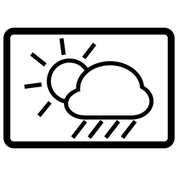
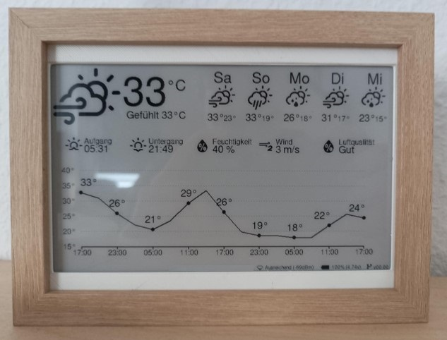
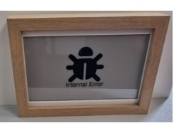
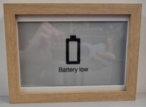
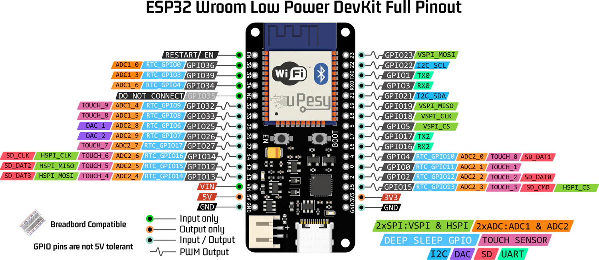
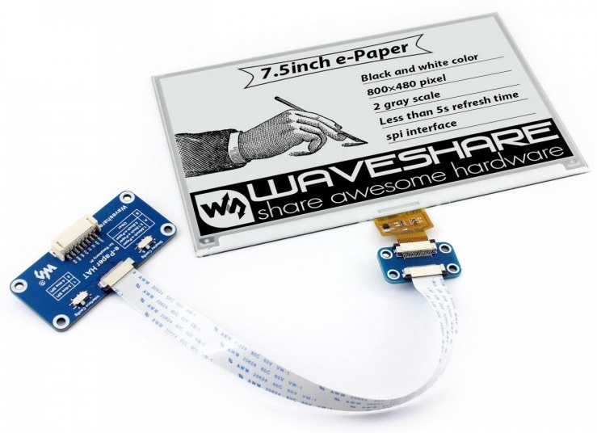
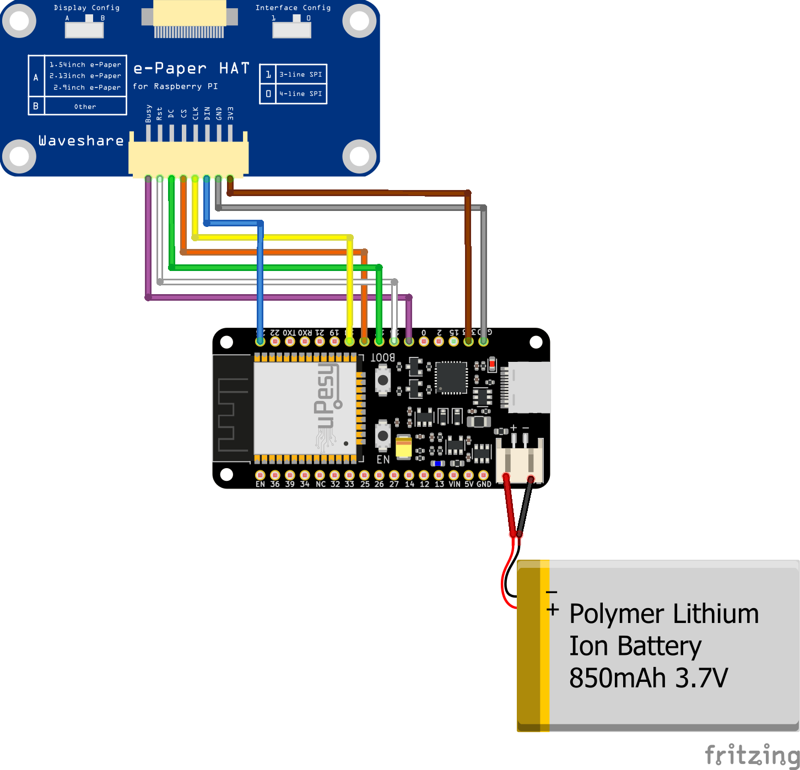

# ESP32-WeatherStation

**NOTE** This project is still being worked on. Use it with care.

---

This is just another Weatherstation that is using an ESP32 as a central unit, an e-paper and the OpenWeatherMap Service to try to create the perfect Weatherstation :).

__Why another ESP WeatherStation ?__

The interesting projects I came across during my research typically utilize the OneCall API from OpenWeatherMap. However, using this API requires an account with credit card information. In contrast, for this particular project, no credit card information is necessary.

Table of Context:

[[_TOC_]]

## Demo

 

## Hardware

### ESP32

I am currently using the following two different development boards for this project but i am considering using others in the future.

uPesy ESP32 Wroom Low Power DevKit

Check Documentation: [doc](https://www.upesy.com/products/upesy-esp32-wroom-low-power-devkit)

Some highlights of the uPesy board:
- USB-C
- Battery Connector and Integrated Battery Charger
- Low Power mode (up to only 8..15uA in deepsleep mode)

Firebeetle 2

### E-Paper

Waveshare 7.5" e-Paper

Check Documentation: [doc](https://www.waveshare.com/product/displays/e-paper/epaper-1/7.5inch-e-paper-hat.html)

Some facts:
- 800*480 pixel resolution
- Only drawing a new image consumes power
- Great visibility in Sunlight
- Wide viewing angles

 

## Additional Hardware
- Thread insert 4x M2 and 4x M2.5
- Picture Frame MDF 13x18cm from Rossman [Rossman link](https://www.rossmann.de/de/haushalt-fotowelt-bilderrahmen-mdf-13x18-cm-weiss/p/4305615709659) or similar.
- White Filament for a 3D printer to create the inlet.

### Wiring diagram

## Software

This project is a Plattform IO project that is more written in a c++ style approach.

### OpenWeatherMap
OpenWeatherMap supports different API´s to agquire weather data.

The "One Call API 3.0" supports 1,000 API calls per day for free and you need to pay only additional querys. However you need a credit card for this service. This project intentionally does not use the api for this reason. Some do not want to specify the credit card everywhere or do not have one in the first place.

Fortunately, Openweathermap also offers apis which are completely free and only an account must be created.
This Project uses the following apis:
- Current Weather Data
- 5 Day / 3 Hour Forecast
- Air Pollution API

Since we want to daily forecast for our Weatherstation but that api is not free to use, we calculate internally the daily weather forcast through the 5 Day / 3 Hour Forecast.

### Icons

The __Weather Icon__ offers a mapping of Weather status codes to their icon [Mapping OpenWeatherMap Weather code to icon](https://erikflowers.github.io/weather-icons/api-list.html) are so perfectly for this project.

# Getting started

You want to buid your own weather station with this project ?
Just follow this steps:

1. Buy the Hardware that is mentioned in the Hardware section
2. Print the inlet with a 3D printer. The STL file you can find in the folder docs.
3. Assemble the Hardware together and connect acording to the wiring diagram.
4. On the Software side clone this repo and adapt the plattform.ini file if you are using a different board.
5. In the folder __plattformio/src/config__ copy the __secrets_template.h__ to __secrets.h__ and insert your Credentials in the file. Additionally change the locations and setting according to your needs in the file __plattformio/src/config/config.h__ 
6. Selct your specific E-paper in the file __plattformio/src/epd/GxEPD2_display_selection_new_style.h__
7. Compile the Plattfrom IO Project and upload
8. Have fun with your weatherstation :)

# Dependcies

## Font

| Name | Description | License | Link | 
|----|----|----|----|
| GNU FreeFont | Free OpenType, TrueType and WOFF vector fonts | GPL 3 | [Project-Link](https://savannah.gnu.org/projects/freefont/) |

## Icons

| Name | Description | License | Link | 
|----|----|----|----|
| Font-Awesome | Icons for bugs and git | CC BY 4.0 License | [Github-link](https://github.com/FortAwesome/Font-Awesome) |
| Google Material Design Icons | Battery and Wifi Icons | Apache License 2.0 | [Github-link](https://github.com/google/material-design-icons) |
| Weather Icons | Weather Icons with description how to map OpenWeatherMap icons this icons |  SIL OFL 1.1 | [Github-link](https://github.com/erikflowers/weather-icons) |

## Software

| Name | Description | License | Link | 
|----|----|----|----|
| GxEPD2 | Arduino Display Library for SPI E-Paper Displays | GPL 3 | [Github-link](https://github.com/ZinggJM/GxEPD2) |
| Adafruit-GFX-Library | Adafruit GFX graphics core Arduino library, this is the 'core' class that all our other graphics libraries derive from | BSD License | [Github-link](https://github.com/adafruit/Adafruit-GFX-Library/tree/master) |
| ArduinoJson | JSON library for Arduino and embedded C++. Simple and efficient. | MIT license | [Github-link](https://github.com/bblanchon/ArduinoJson.git) |
| PubSubClient | MQTT libary | MIT license | [Github-link](https://github.com/knolleary/pubsubclient) |

## Special Credit

This Project is inspired by the Project esp-weather-epd ([Github-link](https://github.com/lmarzen/esp32-weather-epd)). 

Furthermore, it was created as part of a course at our university. Many thanks to our supervisor Carl, who had the idea for this project and supported us very much.

# Version
See file [Changelog](Changelog.md)

# Licensing
See file [LICENSE](LICENSE)

